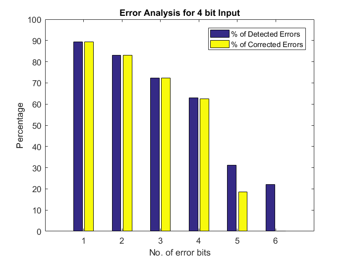

# Sequential-Decoder
Sequential Decoder for Convolutional Codes (Fano's Algorithm) in Matlab for Data Communication and Networking

## Usage
* In `main.m` , update generating functions, number of memory units, bit length to be passed to encoder, and maximum error bits for error analysis.

* Run all the scripts here once to load the functions to the matlab console.

* Run the main module by entering `main` in the matlab console.

* Note that Error Analysis may take some time to generate all cases and compiling the errors based on the compute capabilities required for the given case.

## Example Usage
### Parameters

```Matlab

g1 = [1 1 0 1 1 1 0 0 1];
g2 = [1 1 1 0 1 1 0 0 1];
threshold = 5;
memory_bits = 11;
input_bits = 4;
max_errors = 6;

```


