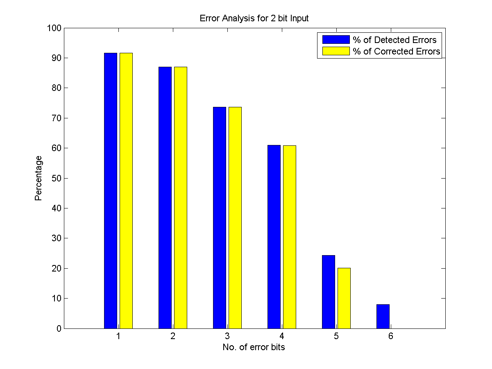
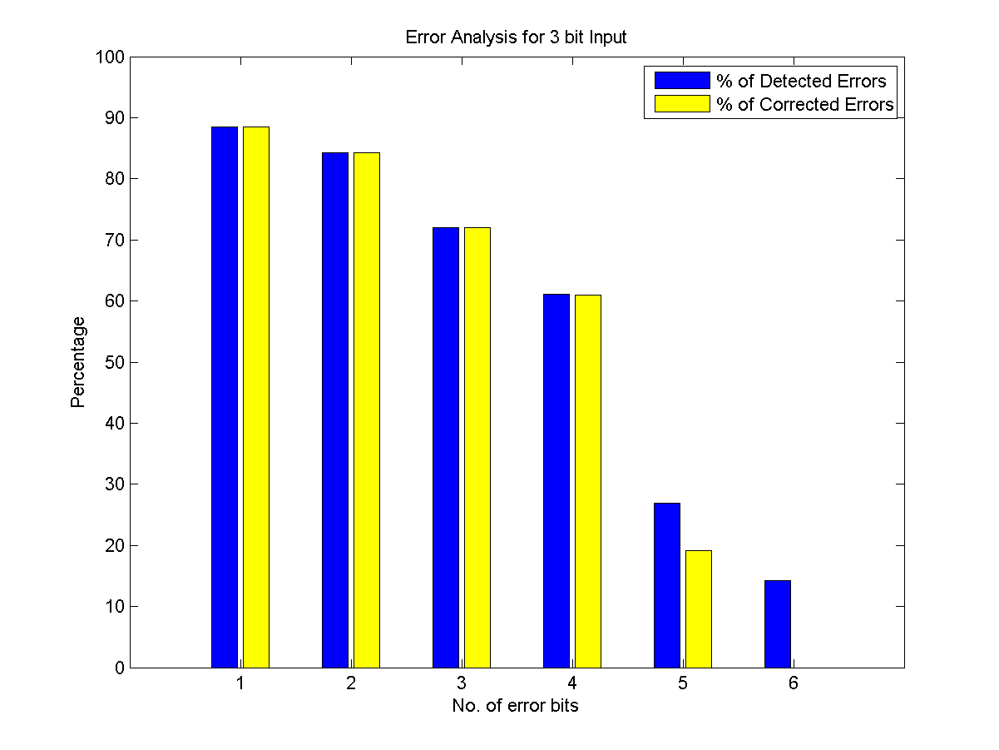
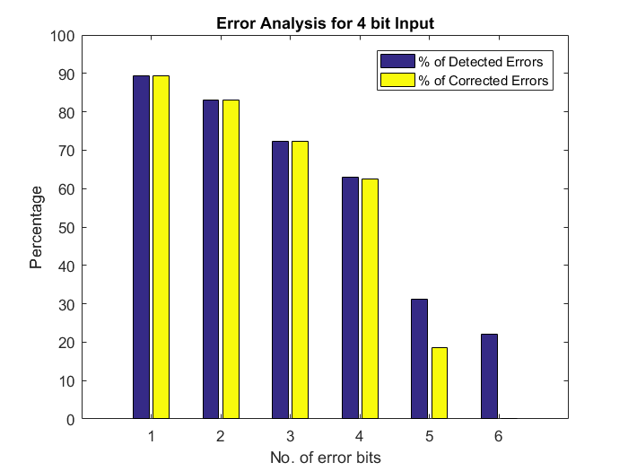

# Sequential-Decoder
Sequential Decoder for Convolutional Codes (Fano's Algorithm) in Matlab for Data Communication and Networking

### Problem Statement

> Q42. MATLAB  code  for  convolution  code  (2,  1,  11)  decoding  with  g1 = 110111001 and  g2  =  111011001  and  the  analysis  of  %  of  error  detection  and correction using sequential decoding with threshold upto 5.

### Contributors
* Praveen Kumar Gupta - 16CO235
* Shashank P - 16CO247

## Usage
* In `main.m` , update generating functions, number of memory units, bit length to be passed to encoder, and maximum error bits for error analysis.

* Run all the scripts here once to load the functions to the matlab console.

* Run the main module by entering `main` in the matlab console.

* Note that Error Analysis may take some time to generate all cases and compile the errors based on the compute capabilities required for the given case.

## Example Usage
### Parameters

```Matlab

g1 = [1 1 0 1 1 1 0 0 1];
g2 = [1 1 1 0 1 1 0 0 1];
threshold = 5;
memory_bits = 11;
input_bits = 4;
max_errors = 6;

```





## Modules
1. `main.m` : Module to enter the required parameters for error analysis.
2. `error_percentage.m` : Returns the percentage of error detected and corrected with the given parameters.
3. `encode.m` : Returns the encoded codeword for a given input data stream.
4. `analyze_kerror.m` : Analyze errors by introducing errors and decoding for k-bits in the encoded codeword.
5. `decode.m` : Recursively decodes the received codeword (which may contain errors) using sequential decoding.
6. `getNextState.m` : Returns the next state and 2-bit convolutional output during state transition.
7. `conv_2bit.m` : Calculates the 2 bit convolutional output during state transition. 

### Limitations
For a n-bit input to be encoded by the encoder, the modules generate all possible codewords by the convolutional encoder with the given generating functions.

Then error are introduced in all possible places in all the encoded codewords from 1,2....`max_errors` count, and every codeword with error is decoded and compared
with the original codeword without errors for analysis of error detection and error correction.

This requires a lot of computation to be done. So error analysis for reasonably sized input and max_errors might take some amount of time for simulation.
